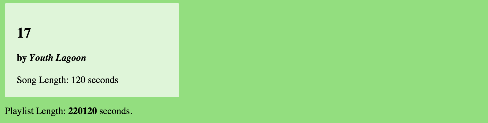
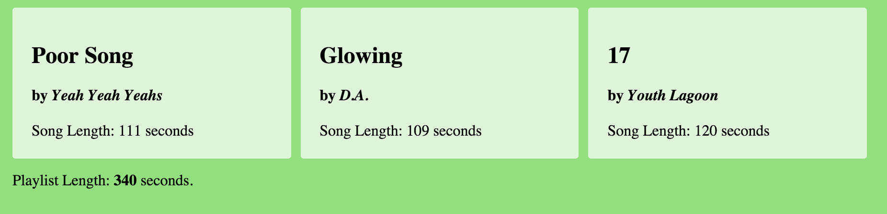

# JavaScript Bugs:

This project has a few bugs in it. Your mission is to figure out where things are going wrong.

### Bug List
1. "Playlist Length is `undefined` seconds" should say the total song playlist length.
2. Once the total length shows up, why is it such a large number? There are only 3 songs.
3. Why is only one song showing up?

#### With Broken Code

#### With Fixed Code

## Setup & Server
1. Run `npm install`
1. Run `npm run watch` to start a server and build assets.
1. Visit localhost:8080
